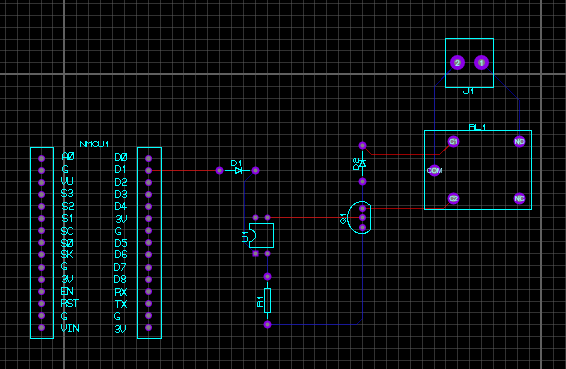

# SISTEMAS_EMBARCADOS_RTOS

## Esquemático

## PCB

## Modelo 3D

# Protocolo MQTT
---
## O que é o MQTT?
MQTT (Message Queuing Telemetry Transport) é um protocolo de comunicação leve e eficiente para a troca de mensagens entre dispositivos conectados à rede. É amplamente utilizado em aplicações de Internet das Coisas (IoT) devido à sua baixa sobrecarga e eficiência na transmissão de dados.

## Broker
O broker é um servidor responsável por gerenciar a comunicação entre dispositivos que utilizam o MQTT. Ele recebe mensagens dos publishers (publicadores) e as distribui para os subscribers (inscritos) que estão interessados em determinados tópicos. O broker garante que as mensagens sejam entregues corretamente aos clientes conectados.

## Subscriber
Um subscriber (inscrito) é um cliente que se inscreve em um ou mais tópicos específicos no broker MQTT para receber mensagens associadas a esses tópicos. Quando uma mensagem é publicada em um tópico ao qual o subscriber está inscrito, o broker encaminha essa mensagem para o subscriber.

## Publisher
Um publisher (publicador) é um cliente que envia mensagens ao broker MQTT em um determinado tópico. O publisher não precisa saber quem são os subscribers; ele apenas envia a mensagem ao broker, que se encarrega de distribuir essa mensagem para todos os subscribers inscritos no tópico relevante.

